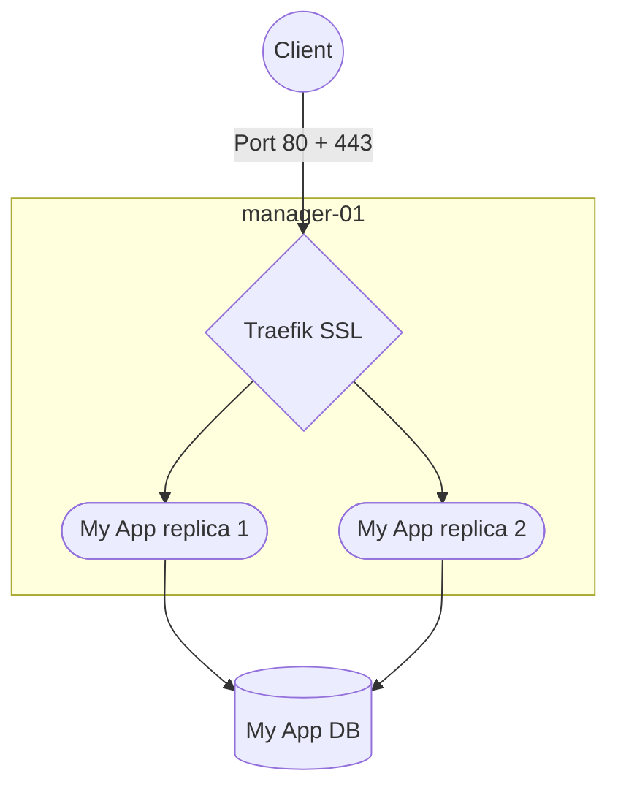
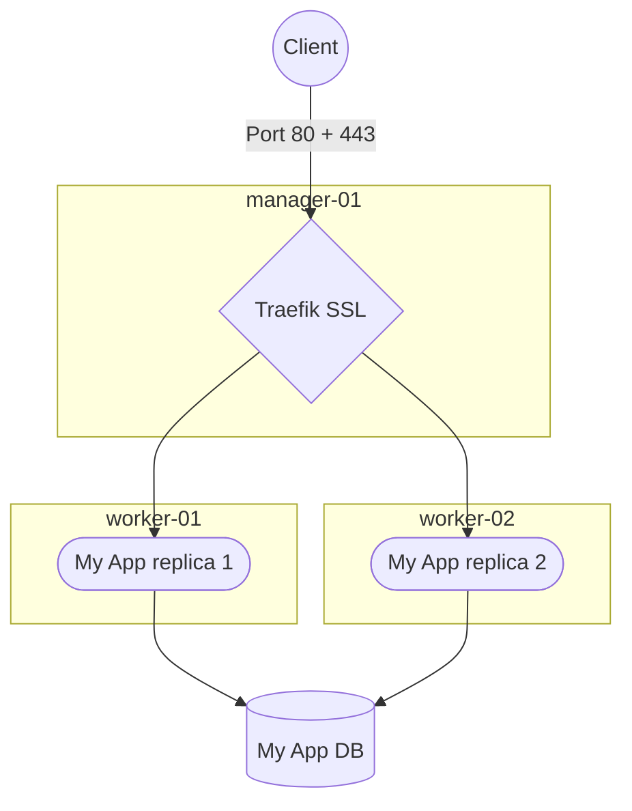
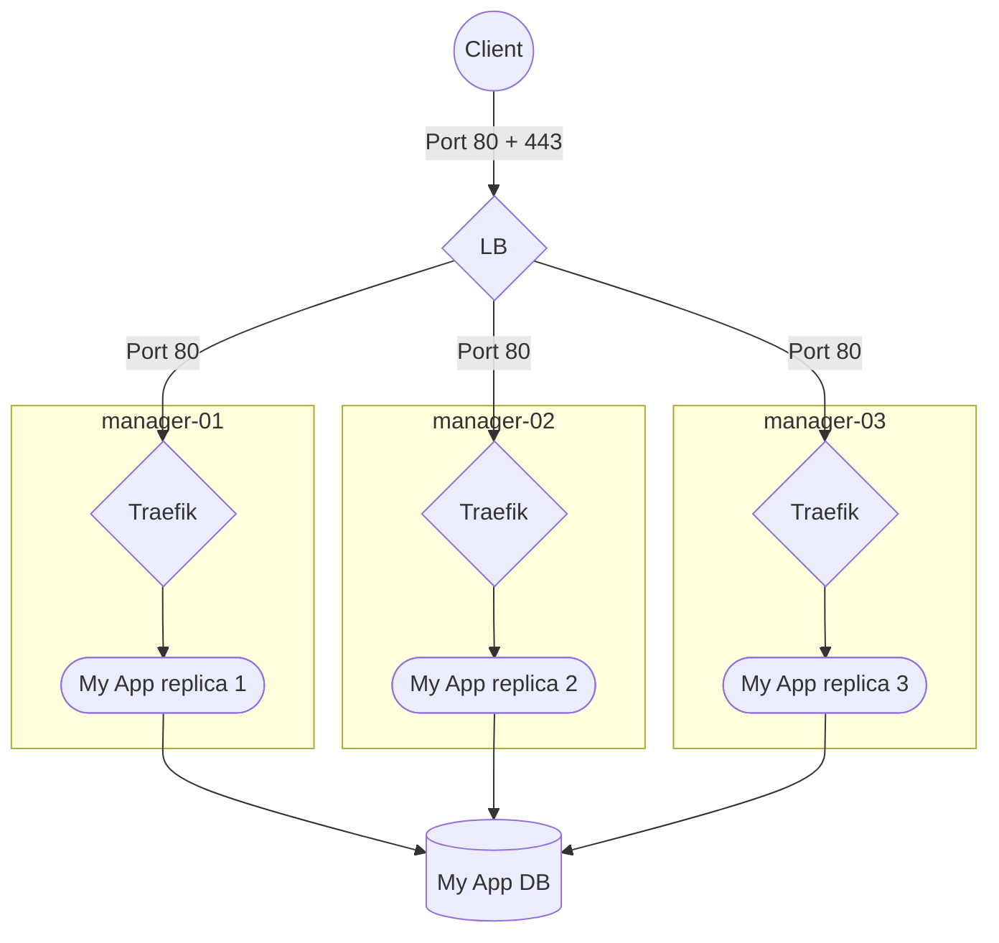
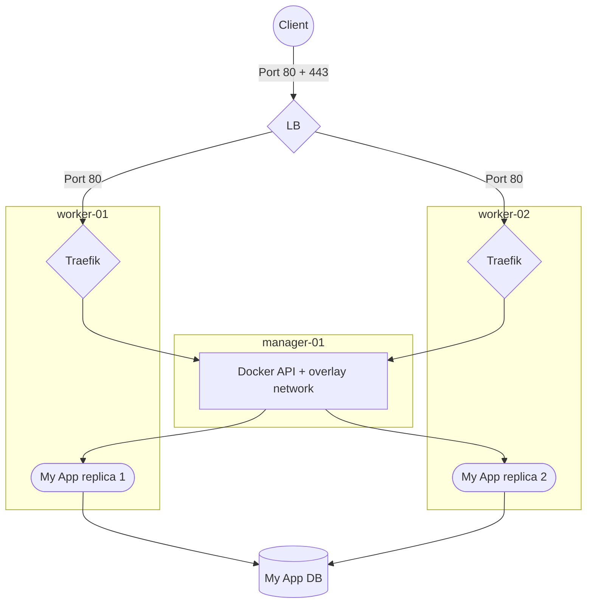
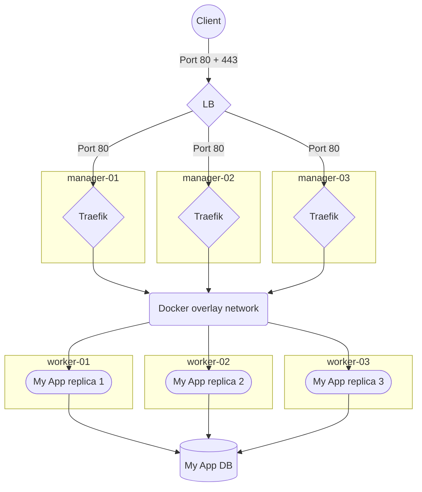

# Terraform Hetzner Cloud Swarm

## 🎯 About

Get a cheap Swarm cluster in less than **5 minutes**, with optional HA support, with easy configuration setup through simple Terraform variables, 💯 GitOps compatible !

This opinionated Terraform template will generate a ready-to-go cloud infrastructure through Hetzner Cloud provider, with a ready-to-go initialized Docker Swarm cluster, the most lightweight container's orchestrator.

Additional managers and workers can be easily added thanks to terraform variables, even after initial setup for **easy upscaling**. Feel free to fork this project in order to adapt for your custom needs.

Check [K3S provider](https://github.com/okami101/terraform-hcloud-microos-k3s) for a full-featured, but more resource consuming, orchestrator based on Kubernetes distribution.

### Networking and firewall

All nodes will be linked with a proper private network as well as **solid firewall protection**. For admin management, only the managers will have open port for SSH (configurable), with **IP whitelist** support. Other internal nodes will be accessed by SSH Jump.

### Load Balancer

Hetzner Load Balancer can be used for any external public access to your cluster. Simply set `lb_type` for a specific nodepool in order to create dedicated LB. Then directly use `hcloud_load_balancer_service` for enabling any services (mostly HTTP / HTTPS), in order to allow maximum flexibility. Check [swarm config](swarm.tf.example) for complete example.

### OS management

## ✅ Requirements

Before starting, you need to have :

1. A Hetzner cloud account.
2. A `terraform` client.
3. A `hcloud` client.
4. A `docker` client.

On Windows :

```powershell
scoop install terraform hcloud
```

## 🏁 Starting

### Prepare

The first thing to do is to prepare a new hcloud project :

1. Create a new **EMPTY** hcloud empty project.
2. Generate a **Read/Write API token key** to this new project according to [this official doc](https://docs.hetzner.com/cloud/api/getting-started/generating-api-token/).

### Setup

Now it's time for initial cluster setup.

1. Copy [this swarm config example](swarm.tf.example) into a new empty directory and rename it `swarm.tf`.
2. Execute `terraform init` in order to install the required module
3. Replace all variables according your own needs.
4. Finally, use `terraform apply` to check the plan and initiate the cluster setup.

## Usage

### Access

Once terraform installation is complete, terraform will output the SSH config necessary to connect to your cluster for each node.

Copy the SSH config to your own SSH config, default to `~/.ssh/config`. After few minutes, you can use `ssh <cluster_name>` in order to log in to your main manager node. For other nodes, the first manager node will be used as a bastion for direct access to other nodes, so use `ssh <cluster_name>-worker-01` to directly access to your *worker-01* node.

### Docker Swarm

#### Join nodes

You must join all managers and workers node manually in order to have fully ready cluster. When logged to bastion, use :

* `docker swarm init --advertise-addr <private_ipv4>` on your first manager to initialize swarm.
* `docker swarm join-token manager` to print command to launch in every manager nodes.
* `docker swarm join-token worker` to print command to launch in every worker nodes.

Use `docker node ls` to check that all nodes are correctly joined to the cluster.

Finally, for remote usage from docker CLI through a secured SSH tunnel, you can use following command from your local machine :

```sh
# create a new docker context
docker context create --docker host=ssh://<cluster_name> --description="My Swarm cluster" my-swarm-cluster

# use it
docker context use my-swarm-cluster

# check it
docker info
docker node ls
```

#### Upscaling and downscaling

You can easily add or remove nodes by changing the `count` variable of each worker or manager. Then use `terraform apply` to apply the changes.

* When adding, the new manager or worker node will be automatically created, but you still need to join it to the cluster by using above related command.

## Topologies

Contrary to Kubernetes which is really suited for a specific kind of topology (HA in front of workers), Docker can have more scenarios. Here are some examples of topologies you can use with this Terraform template.

### Docker compose



Pros :

* The cheapest and dead simplest solution
* No swarm involved, so no cluster state headaches, use directly docker-compose

Cons :

* No HA, mandatory downtime for maintenance
* No horizontal scalability, only vertical
* No zero downtime achievable without custom scripts
* All resources constrained to 1 single node, high SRP violation
* Need SSL management for Traefik
* Server exposed to public internet

### 1 manager + X workers



Pros :

* A balanced cheap while performant option
* Horizontal scalability excluding Traefik
* Workload mostly separated from manager, securing the cluster from congestion

Cons :

* No HA, mandatory downtime for manager maintenance
* Need SSL management for Traefik
* When high load, Traefik can be a bottleneck
* Cluster exposed to public internet

### X managers + LB



Pros :

* The cheapest HA solution
* Load Balancer takes care of SSL
* Zero downtime achievable

Cons :

* Need at least 3 managers or any superior odd number (7 max) in order to maintain quorum
* Limited horizontal scalability
* Risk of unresponsive swarm cluster if high load

### 1 manager + X workers + LB



Pros :

* Load Balancer takes care of SSL
* Zero downtime achievable
* Horizontal scalability
* Free to add workers easily
* Workload clearly separated from manager, no congestion risk in managers
* The topology used in Kubernetes world

Cons :

* A little more expensive
* No HA for manager
* In order to work, Traefik must be configured for using manager docker API endpoint, otherwise it will not be able to detect newly added services. You can use Socat as simple socket proxy for this purpose.
* If more than 1 manager, you way prefer next topology, which moves Traefik to managers.

### X managers + Y workers + LB



Pros :

* The most robust HA solution for managers and workers
* Free to add managers and workers easily
* Full horizontal scalability for managers and workers

Cons :

* The most expensive solution

### Topologies Summary

| Topology                    | HA  | Horizontal scalability | Cost | Workload repartition |
| --------------------------- | --- | ---------------------- | ---- | -------------------- |
| Docker compose              | -   | -                      | -    | -                    |
| 1 manager + X workers       | +   | ++                     | +    | ++                   |
| X managers + LB             | ++  | +                      | ++   | +                    |
| 1 manager + X workers + LB  | ++  | ++                     | ++   | +++                  |
| X managers + Y workers + LB | +++ | +++                    | +++  | +++                  |

## 📝 License

This project is under license from MIT. For more details, see the [LICENSE](https://adr1enbe4udou1n.mit-license.org/) file.

Made with :heart: by <a href="https://github.com/adr1enbe4udou1n" target="_blank">Adrien Beaudouin</a>
